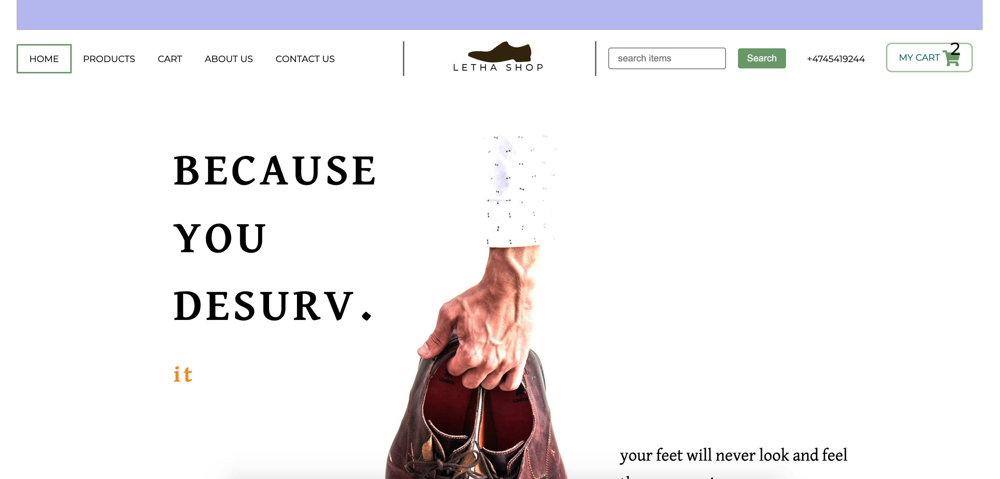

# Interaction Design Cross Course ca



The main purpose of this project is to deliver a product that respects the design techniques and principles and to follow the path
From making personas to creating scenarios and story board to ideation and implementation

## Description

this is letha shoes website, that deliverers a product to a targeted user type , users that are :

- men looking for hight quality shoes
- for daily use
- for occasions
  after i went throw the research of the audience and made my personas
  a new process of delivering easily the product via my website ,
  as a user i would like to :
- easy scan of the website
- easy finding and searching for products
- easy finding prices and info regarding the fabric and colors, sizes .
- easy way to buy with high profile of insurance

a list of my tasks were grouped in this list :
Find product :

- Generated tasks : browse categories , basic search , recommendations by emails, touch points ,advenced search , filter in categories
- Examin product:
  See details and info, preview , compare to other products Add to cart :
  Add to cart, save for later , continue shopping, add to wish list
- Sign up :
  use email, or connect with social media
  Order and pay :
- Place order, Enter card details ,save data from last visit
- Ship to user :
  Enter adress details, national, international
  the website contains four pages,

- home page: with a clear sale advertisement on the top , this is a good way to implement interaction design principles. and quick presenting the purpose of the website : selling.
- products page : with mode detailed cards and information about the shoes.
- about us page : here as a user i would like to get confident, presenting the brand and delivering all information needed is important to build trust.
- contact us : where user will find all contact info.
- cart page : with a summary of chosen items so far.

## Built With

i used mainly html and css and a bit of java script, functionalities regarding adding to cart and form validation were not requested.

- [ Html ]
- [ Css ]
- [ Javascript ]

## Getting Started

### Installing

the site easy going with no installation required , the responsiveness in this project was not required,

1. Clone the repo:

```bash
https://github.com/lacdart2/cross-course-ca.git
```

2. Install the dependencies:

```
no installation required
```

### Running

runs at once no needs to install any packages

```bash

```

## Contributing

website better to be viewed on larger desktops as its not responsive as it was not requested.

## Contact

[My Twitter page](https://twitter.com/LakhdarKader)

[My LinkedIn page](https://www.linkedin.com/in/lakhdar-hafsi-24b31060/)
